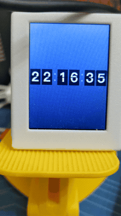

# FlipClock

ESP32-C3 翻页时钟，基于 ST7789 LCD (240x320) 显示翻页动画效果的数字时间。

## 效果

<p align="center">
  
</p>

翻页动画通过梯形条带变形模拟透视缩短，上半卡片折下后下半卡片展开，配合侧面厚度渲染，还原真实翻页钟的视觉效果。

## 硬件

| 组件 | 型号 |
|------|------|
| MCU | ESP32-C3 (esp32-c3-devkitm-1) |
| 显示屏 | ST7789, 240x320, SPI |
| Flash | DIO 模式, 80MHz |

### 接线

| 引脚 | GPIO |
|------|------|
| MOSI | 3 |
| SCLK | 2 |
| DC | 4 |
| RST | 5 |
| CS | 7 |

## 构建与烧录

需要 [PlatformIO](https://platformio.org/) 环境。

```bash
pio run                    # 构建
pio run --target upload    # 烧录
pio device monitor         # 串口监视 (115200)
```

## 项目结构

```
src/
  main.cpp      # 主程序：SPI 初始化、翻页动画渲染、时间推进
  digitals.h    # 0-9 数字位图 RGB565 预合成数据（上下半各 32x24）
platformio.ini  # PlatformIO 构建配置
```

## 技术细节

- **动画**: 20FPS，每秒数字变化触发 20 帧翻页动画（前 10 帧上半折下，后 10 帧下半展开）
- **渲染**: GFXcanvas16 离屏渲染，全帧 memcpy 到 LCD，无局部刷新闪烁
- **性能**: 浮点运算在启动时预计算为查找表，运行时零浮点操作
- **数字卡片**: 32x48 像素，上半/下半各 24 像素，12 条带梯形变形

## 依赖

- Arduino Framework (C++11)
- Adafruit GFX Library 1.12.6
- ST7789_AVR 1.2.3
